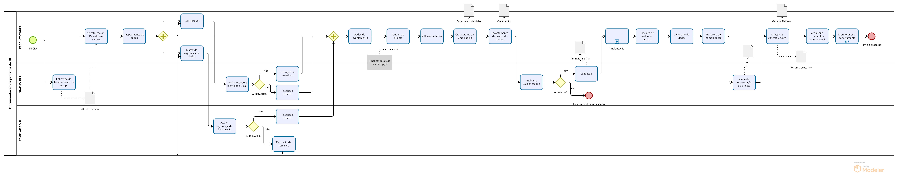

## Resultado - Painel

| Aqui entrará o painel do power bi

## Processo de desenvolvimento de projeto

Por trás de todo desenvolvimento de uma solução de BI, há um arcabouço teórico por trás, nesse projeto de estudo, não é diferente. Lembrando, que de acordo com as boas práticas de desenvolvimento de projetos PMBOK 7th,
temos que um projeto deve ser construído com um objetivo específico e há um prazo de início, construção e entrega. Tratando de um projeto de dados, não é diferente, de acordo com Carlos Barbieri em seu livro, Governança de Dados,
um projeto de dados, deve ser principalmente efetiva na geração de resultados na companhia. Ou seja, resolver as dores dos *stakholders*.

### Metodologia de documentação

Nesse projeto foi desenvolvido o fluxo de documentos, seguindo as boas práticas de documentação, de acordo com modelo BPMN abaixo, desenha com o auxílio do software Bizagi.

#### Entrevista

Ao entrevistar nosso principal *stakeholder*, aqui chamado de João. João é um gerente de logística, que relata ter muita dificuldade de saber a "saúde" da operação, seja nas tomadas de decisão em curto prazo.
Por exemplo:

     Há vezes que tenho que montar uma carga, antes do caminhão chegar, visto que nossa operação é muito quente. O cliente cobra e nem sempre o time sabe dizer qual a expectativa de retorno do veículo. Então
     nesse sentido é necessário um solução "pensei em algo como um painel" para visualizar os indicadores que tenham maior flutuação.

Outro dor do João foi:
    Há cobrança da diretoria para saber o desempenho global, o quanto estamos avançando, principalmente com relação a outros períodos. Sei que estamos ficando melhores, mas não sei medir isso especificamente.

